# Diagrama Técnico - Network Manager TUI

```mermaid
graph TD
    %% Core Application
    A[main.go] --> B[cmd/root.go]
    B --> C[internal/ui/app.go]
    
    %% Packages & Dependencies
    D[Packages] --> D1[github.com/charmbracelet/bubbletea]
    D --> D2[github.com/charmbracelet/lipgloss]
    D --> D3[github.com/gdamore/tcell/v2]
    D --> D4[github.com/rivo/tview]

    %% Core Components
    C --> E[menu/menu.go]
    C --> F[network/network.go]
    C --> G[logger/logger.go]
    C --> H[i18n/i18n.go]

    %% Network Management
    F --> F1[NetworkManager CLI]
    F --> F2[System Commands]
    F --> F3[Network Interfaces]
    F --> F4[Connection Manager]

    %% System Components
    I[System] --> I1[Privilege Handler]
    I --> I2[Process Manager]
    I --> I3[System Info]
    I --> I4[Hardware Info]

    %% Data Flow
    J[Data Flow] --> J1[User Input]
    J --> J2[System Events]
    J --> J3[Network Events]
    J --> J4[Error Handling]

    %% Development Tools
    K[Dev Tools] --> K1[Debug Mode]
    K --> K2[Test Environment]
    K --> K3[Mock Data]
    K --> K4[Performance Monitoring]

    %% Security Layer
    L[Security] --> L1[Root Check]
    L --> L2[Command Validation]
    L --> L3[Input Sanitization]
    L --> L4[Error Recovery]

    %% UI Components
    M[UI Layer] --> M1[TUI Components]
    M --> M2[Event Handlers]
    M --> M3[State Management]
    M --> M4[Render Pipeline]

    subgraph Core_Architecture
        A
        B
        C
        D
    end

    subgraph Technical_Components
        F
        G
        H
        I
    end

    subgraph Development_Layer
        K
        L
        M
    end

    %% Integrations
    N[External] --> N1[Network Stack]
    N --> N2[System APIs]
    N --> N3[Hardware Interface]
```



## Detalhes Técnicos

### Estrutura de Arquivos
```
├── main.go                 # Entry point
├── cmd/
│   └── root.go            # Command initialization
├── internal/
│   ├── ui/                # Interface components
│   ├── network/           # Network operations
│   └── utils/             # Utilities
├── logger/                # Logging system
└── i18n/                  # Internationalization
```

### Componentes Principais
1. **Core (main.go)**
   - Inicialização da aplicação
   - Gestão de estados
   - Roteamento principal

2. **UI (internal/ui/)**
   - Renderização TUI
   - Gerenciamento de eventos
   - Componentes visuais

3. **Network (network/)**
   - Interface com NetworkManager
   - Configuração de rede
   - Monitoramento

4. **Logger (logger/)**
   - Sistema de logs
   - Rotação de arquivos
   - Debug mode

### Desenvolvimento
1. **Debug Mode**
   - Flag `-dev`
   - Mock data
   - Bypass root check

2. **Testing**
   - Unit tests
   - Integration tests
   - Mock interfaces

3. **Performance**
   - Event profiling
   - Memory tracking
   - UI optimization

### Dependências
- bubbletea: Framework TUI
- lipgloss: Estilização
- tcell: Terminal UI
- tview: Componentes visuais

### Segurança
1. **Validações**
   - Input sanitization
   - Command validation
   - Error handling

2. **Privilégios**
   - Root check
   - Permission validation
   - Safe mode
