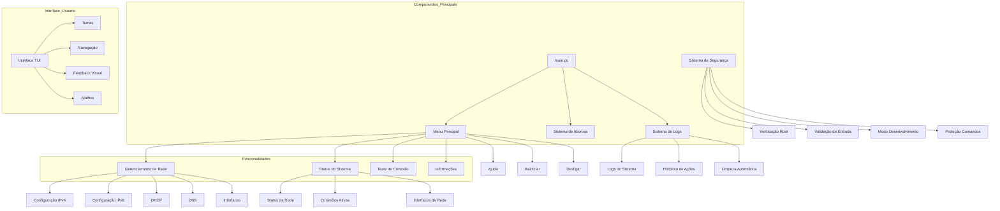

# Diagrama do Network Manager TUI

## Descrição da Arquitetura

### 1. Componentes Principais
- **main.go**: Ponto de entrada da aplicação
- **Menu Principal**: Interface central de navegação
- **Sistema de Idiomas**: Suporte a múltiplos idiomas
- **Sistema de Logs**: Registro de atividades
- **Sistema de Segurança**: Proteção e validação

### 2. Gerenciamento de Rede
- Configuração completa de rede IPv4/IPv6
- Suporte a DHCP e DNS
- Gerenciamento de interfaces de rede
- Monitoramento de conexões ativas

### 3. Segurança
- Verificação de privilégios root
- Validação de entrada de dados
- Modo de desenvolvimento seguro
- Proteção contra comandos perigosos
- Histórico de alterações

### 4. Monitoramento
- Status da rede em tempo real
- Informações do sistema
- Teste de conectividade
- Monitoramento de recursos

### 5. Interface do Usuário
- Temas personalizados
- Navegação intuitiva
- Feedback visual
- Atalhos de teclado
- Suporte a múltiplos idiomas

### 6. Sistema de Logs
- Registro detalhado de ações
- Histórico de modificações
- Limpeza automática após 90 dias
- Exportação de logs

### 7. Recursos Adicionais
- Reinicialização segura
- Desligamento controlado
- Sistema de ajuda integrado
- Backup de configurações
