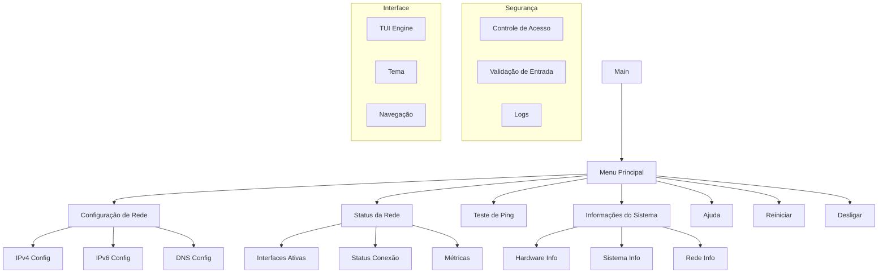

# Diagrama do Network Manager TUI

```mermaid
graph TD
    A[Main] --> B[Menu Principal]
    B --> C[Configuração de Rede]
    B --> D[Status da Rede]
    B --> E[Teste de Ping]
    B --> F[Informações do Sistema]
    B --> G[Ajuda]
    B --> H[Reiniciar]
    B --> I[Desligar]

    C --> C1[IPv4 Config]
    C --> C2[IPv6 Config]
    C --> C3[DNS Config]

    D --> D1[Interfaces Ativas]
    D --> D2[Status Conexão]
    D --> D3[Métricas]

    F --> F1[Hardware Info]
    F --> F2[Sistema Info]
    F --> F3[Rede Info]

    subgraph Segurança
    S1[Controle de Acesso]
    S2[Validação de Entrada]
    S3[Logs]
    end

    subgraph Interface
    UI1[TUI Engine]
    UI2[Tema]
    UI3[Navegação]
    end
```
